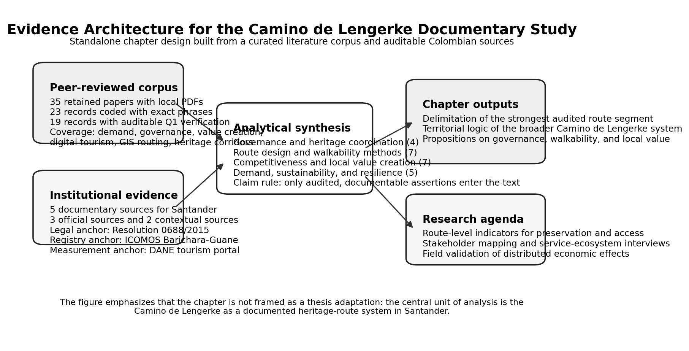
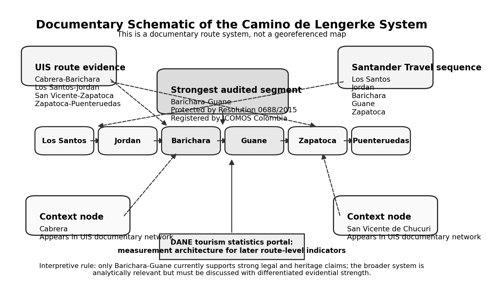

# Sustainability Conditions in Heritage Walking Routes: Benchmarking the Camino de Lengerke Against the Camino de Santiago

## Abstract

Heritage walking routes are frequently framed as sustainable territorial assets, yet the evidence supporting that label is highly uneven across cases. This study uses an asymmetric secondary-source comparison to benchmark the Camino de Lengerke in Santander, Colombia, against the far better documented Camino de Santiago and related route studies. The purpose is not to claim equivalence between the two routes, but to identify which sustainability conditions are well evidenced in mature route systems and which remain weakly documented in the Colombian case. The source base combines a curated corpus of 35 locally stored peer-reviewed articles and five auditable Colombian institutional sources. Screening rules prioritized direct thematic relevance, local PDF availability, phrase-level coding, and auditable source status before claims entered the argument. The findings show that the Barichara-Guane segment is the strongest evidentiary anchor because it is both legally protected and registered in the national heritage field, while the broader Camino de Lengerke system rests on weaker and more uneven support. The comparison also shows that sustainable route performance depends on more than historical meaning: consolidated route systems are better documented in terms of stakeholder coordination, route operability, user motivations, resilience, service ecosystems, carrying-capacity management, and monitoring. The central gap in the Camino de Lengerke is therefore not simply visibility, but the absence of a sufficiently documented sustainability architecture. The analysis closes by identifying the conditions that would need to be strengthened in Santander, especially governance, walkability, service integration, digital visibility, and route-level indicators.

## Keywords

heritage walking routes, Camino de Santiago, Camino de Lengerke, sustainable tourism, secondary-source comparison

## Introduction

Heritage walking routes provide a useful framework for analyzing how tourism, cultural assets, and territorial development interact. Unlike single-site attractions, routes organize landscapes, settlements, and services into sequences of movement and interpretation. This gives them particular relevance for regional development because value can be distributed across accommodations, food services, guiding, mobility support, handicrafts, and place branding along the itinerary rather than concentrated in one terminal destination (Duarte-Duarte et al., 2021). At the same time, the literature warns against treating any route as sustainable by default. Tourism sustainability depends on whether preservation, management, and stakeholder coordination are actually aligned in practice (Aas et al., 2005; Buckley, 2012; Liu, 2003).

Route-based tourism is especially important when the route itself is part of the heritage resource. In pilgrimage and walking tourism, the path is not only a connector between attractions; it is also a social, symbolic, and spatial experience. Studies on the Camino de Santiago and comparable routes show that contemporary walkers are motivated not only by religion, but also by spirituality, nature, personal transformation, wellbeing, and community seeking. Amaro et al. (2018), using 1,140 valid responses from 45 nationalities, found religious motivations to be the least important, while Grocutt and Wood (2025) show that solo pilgrimage walking can strengthen wellbeing, identity, resilience, and search for community. Other studies show both the vulnerability of pilgrimage systems to shocks and the importance of route management for long-term sustainability. Mroz (2021) reports a 90-95% decline in pilgrimage movement during the first six months of the pandemic, Sati (2026) links pilgrimage tourism with employment, income, and livelihood sustainability, and Kuniyal et al. (2025) show that sustainable route performance also depends on carrying-capacity management and daily-use thresholds rather than on simply increasing arrivals. Taken together, these studies suggest that route systems become development assets only when heritage value, visitor experience, local livelihoods, and operational management remain connected.

The Camino de Lengerke offers a relevant Colombian case precisely because it stands at the opposite end of that evidentiary spectrum. The strongest anchor in the current source base is the Camino Real de Barichara a Guane. ICOMOS Colombia identifies the route between Barichara and Guane and links it to Resolution 0688 of March 20, 2015, while the Ministry of Culture resolution legally approves the protection framework for the historical center of Barichara, the Camino de Guane, and their zones of influence (ICOMOS Colombia, n.d.; Ministerio de Cultura de Colombia, 2015). This gives the case a firmer institutional basis than a purely anecdotal historical narrative. Beyond that protected segment, UIS Caminos de Santander documents a broader set of route segments associated with the Camino de Lengerke, and Santander Travel preserves a regional sequence that connects Los Santos, Jordan, Barichara, Guane, and Zapatoca (Santander Travel, n.d.; UIS Caminos de Santander, n.d.). DANE adds a complementary layer by showing that Colombia already maintains a national tourism statistics architecture that could support later route-level measurement, even though route indicators for this corridor are still missing (DANE, n.d.).

The central problem, therefore, is not whether the Camino de Lengerke exists as a cultural memory or tourism narrative, but how far the available evidence supports treating it as a sustainable heritage-route system when compared with a far better documented benchmark. This study addresses that problem through three questions. First, what does the benchmark literature show about the conditions that support sustainable route performance? Second, which of those conditions are already documented, weakly documented, or absent in the current evidence base on the Camino de Lengerke? Third, what would need to be strengthened in Santander if the route is to move toward comparable sustainability conditions without pretending to replicate Santiago's scale, symbolic capital, or tourism maturity?

The analysis contributes in four ways. It uses the Santiago-centered and comparator route literature as a benchmark rather than as a template for direct replication. It delimits the strongest anchors and the weakest evidential zones of the Camino de Lengerke. It reframes the core problem as a sustainability gap involving governance, route operability, service ecosystems, carrying-capacity management, and monitoring rather than mere visibility. Finally, it translates that gap into a field-oriented agenda that can guide later empirical work in Santander.

## Methodology

The study uses an asymmetric documentary-comparative design focused exclusively on auditable secondary evidence. The comparison is asymmetric because the Santiago-centered and comparator corpus is much richer than the source base currently available for the Camino de Lengerke. The literature corpus comes from a locally stored and previously curated article matrix with 35 DOI-level records retained after removing clearly irrelevant or duplicate material. All 35 records have local PDF availability, 23 already contain phrase-level coding, and 20 include auditable Q1 verification notes in the evidence matrix. The Colombian evidence base comes from five web sources that were retained because they either provide direct legal or registry support for the case or help to delimit the broader route system in Santander.

Rather than treating all sources as equally authoritative, the study applies differentiated claim rules and an explicit benchmark logic. The mature-route corpus is used to identify what sustainable route systems are typically documented in terms of motivations, governance, resilience, route design, carrying capacity, and local value creation. Official Colombian legal and registry sources are used for strong statements about protection status and route identification. Academic-regional sources are used to frame the broader route network when they provide explicit segment information. Contextual tourism-promotion sources are used only to support route sequence and regional narrative, not as sole evidence for legal or historical claims. The analytical goal is therefore not route equivalence but gap identification: which sustainability conditions are well evidenced in the comparison corpus and which are still absent, partial, or untested in the Camino de Lengerke case. Table 1 summarizes that asymmetric design.

Table 1. Asymmetric secondary-source design and claim rules

| Evidence stream | Units retained | Screening logic | Main analytical contribution | Claim boundary |
| --- | --- | --- | --- | --- |
| Benchmark literature on Santiago and comparator routes | 35 papers with local PDFs; 23 coded; 20 Q1 verified | Retained only when directly relevant to route tourism, governance, sustainability, competitiveness, value creation, or route design | Identifies the sustainability conditions that better-documented route systems tend to document well | Cannot be transferred mechanically to Santander |
| Official Colombian documentary sources | 3 sources: Ministry of Culture, ICOMOS Colombia, DANE | Included when directly auditable and institutionally authoritative | Establishes legal protection, route identification, and national tourism measurement architecture for the Camino de Lengerke | Does not provide complete route-level performance indicators |
| Regional academic-contextual sources on Lengerke | 2 sources: UIS Caminos de Santander and Santander Travel | Included when they specify route segments or regional sequence relevant to the case | Expands the documentary understanding of the wider Camino de Lengerke system | Cannot be used as the sole basis for legal or conservation claims |
| Colombian route-method source | 1 required article: Duarte-Duarte et al. (2021) | Retained because it offers a local route-identification method linked to clustering and point-of-interest integration | Bridges the benchmark literature and the Colombian case through a local route-design logic | Does not validate specific segments without local observation |
| Cross-source decision rule | Applied to all evidence | Strong claims require official or corroborated documentary support; broader statements require explicit hedging | Protects the analysis from overclaiming and keeps the Santiago-Lengerke contrast analytically disciplined | Keeps the study as documentary research rather than pseudo-fieldwork |

The analytical procedure had four stages. First, the retained literature was grouped into five substantive domains: heritage governance, sustainability and resilience, local value creation and competitiveness, digital or service innovation, and route planning or heritage-corridor design. Second, matrix-coded excerpts were used to recover traceable claims instead of relying on generic paraphrase. Third, the evidence for Santander was compared across source types to distinguish the protected Barichara-Guane segment from the broader but more unevenly supported route system. Fourth, both sides were read through a gap lens: what the comparison corpus documents clearly and what the Camino de Lengerke still lacks in terms of governance, operability, carrying capacity, and measurement.

No claim is made here to have measured economic impact, visitor volumes, or stakeholder perceptions directly in Santander. The contribution lies in delimiting the case, organizing the comparison corpus, and identifying the sustainability gap that separates a historically meaningful but weakly documented Colombian route from the kinds of enabling conditions that are much better evidenced in mature route systems.

Figure 1. Evidence architecture of the asymmetric secondary-source design, showing how the benchmark literature and the audited Colombian evidence base are translated into route delimitation, sustainability-gap identification, and a future field agenda.

## Results and Discussion

### A. An asymmetric comparison: a well-documented benchmark and an underdocumented route

The first result is evidential, not rhetorical. The comparison corpus allows route motivations, resilience, stakeholder coordination, route design, wellbeing outcomes, and competitiveness to be discussed in relatively specific terms. The Camino de Lengerke cannot yet be discussed at that same level of empirical density. It can, however, be treated as a route case whose claims must vary by segment and by source type. The Barichara-Guane segment is the strongest audited anchor because it is simultaneously supported by the Ministry of Culture resolution and by the ICOMOS Colombia heritage record. That combination supports treating the segment as a protected heritage route with an institutional governance anchor (ICOMOS Colombia, n.d.; Ministerio de Cultura de Colombia, 2015). By contrast, the broader Camino de Lengerke system is supported mainly by the UIS academic-regional project and by the regional tourism sequence preserved by Santander Travel (Santander Travel, n.d.; UIS Caminos de Santander, n.d.). These sources are useful and meaningful, but they do not carry the same legal weight as the protection instruments for Barichara-Guane.

This distinction matters because route-based development debates often become inflated by narrative continuity. In the present case, the available evidence supports a more precise interpretation: the Camino de Lengerke is best approached as a historical mobility system with one strongly auditable protected segment and a broader set of associated corridors that remain analytically relevant but unevenly supported. That is sufficient to justify research and planning interest, yet it is not sufficient to claim a fully consolidated route product. The relevant contrast with Santiago is therefore not route equivalence, but evidentiary maturity: Santiago functions here as a benchmark of what a sustainable route system tends to document, whereas Lengerke still reveals substantial empirical blind spots.

Table 2. Documentary status of the Camino de Lengerke system

| Route element or evidence layer | Main source support | Evidential strength | Auditable interpretation |
| --- | --- | --- | --- |
| Barichara-Guane protected segment | Resolution 0688 of 2015; ICOMOS Colombia record | High | This segment is a protected heritage route with an institutional governance anchor and a documented zone of influence |
| Los Santos-Jordan and Zapatoca-Puenteruedas segments | UIS Caminos de Santander | Medium | These segments can be treated as part of the broader documentary network associated with the Camino de Lengerke |
| Cabrera-Barichara and San Vicente de Chucuri-Zapatoca references | UIS Caminos de Santander | Medium | These corridors matter for route-system framing but require later local validation before stronger tourism-management claims |
| Los Santos-Jordan-Barichara-Guane-Zapatoca sequence | Santander Travel | Medium-low | This sequence is useful for regional narrative and route continuity, but not as standalone legal proof |
| Tourism measurement architecture | DANE tourism statistics portal | High for national baseline, low for route specificity | Colombia has a usable tourism measurement platform, but route-level indicators for Camino de Lengerke still need to be built |

The route schematic in Figure 2 makes this argument visible. It does not pretend to be a georeferenced map. Instead, it translates the documentary record into a transparent diagram that separates the protected segment from the wider route narrative and links both to the statistical baseline represented by DANE. This is more appropriate for the current stage of research than a pseudo-cartographic figure that would imply greater spatial certainty than the evidence permits.

Figure 2. Documentary schematic of the Camino de Lengerke system, emphasizing the Barichara-Guane protected segment, the broader route network described by UIS, the contextual sequence preserved by Santander Travel, and the statistical baseline represented by DANE.

### B. Heritage governance and sustainability conditions

Once the case is delimited, the second result concerns governance. The literature consistently shows that heritage routes become development assets only when conservation and tourism management are handled together. Aas et al. (2005) argue that heritage conservation and tourism development are interdependent and require stakeholder collaboration rather than sectoral isolation. Liu (2003) and Buckley (2012) add an important warning: sustainability language is analytically weak when it is used as a label rather than as a test of whether institutions, practices, and outcomes are actually aligned.

This warning is especially relevant for the Camino de Lengerke. A protected or historically meaningful route does not generate sustainable development automatically. Governance still has to address maintenance, access conditions, interpretation, public appropriation, and coordination among municipalities, cultural actors, local businesses, and community groups. Recent evidence from other destinations reinforces this point. Kabbara et al. (2026) show that sustainability implementation in tourism still faces resource constraints, policy gaps, and coordination problems. Fan et al. (2026) make the point even more concretely by reporting that their cluster-protection framework achieved 23% greater resource efficiency than conventional approaches while balancing preservation and tourism use.

Community participation is another condition that should be explicit from the start. Liu et al. (2026), in a PRISMA-based review of 53 articles, emphasize that residents are key stakeholders in sustainable cultural heritage tourism and that cultural identity and empowerment should not be treated as secondary concerns. This is important for the Camino de Lengerke because the route crosses or relates to inhabited settlements whose interests may not coincide automatically with tourism expansion. A route that improves visibility but weakens local control, heritage meaning, or everyday livability would be difficult to defend as a sustainable regional-development strategy.

The Colombian documentary evidence aligns with this governance perspective. The Barichara-Guane protection framework is not only about preservation in a narrow architectural sense. The wording of Resolution 0688 of 2015 explicitly links protection, recovery, sustainability, and public appropriation. That vocabulary supports a territorial reading of the case: the route already belongs to a policy field in which conservation and use must be managed together. The development question, therefore, is not whether tourism should replace conservation, but how conservation, accessibility, and local service provision could be coordinated without degrading heritage value.

### C. Local value creation, livelihoods, and territorial competitiveness

The third result concerns how value creation should be conceptualized. The reviewed literature suggests that route competitiveness does not depend only on attracting visitors. It depends on the route's ability to connect heritage meaning with a functioning service ecosystem. Amaro et al. (2018) show that route users are motivated by multiple drivers, including spirituality, new experiences, and nature; Grocutt and Wood (2025) add that pilgrimage walking can also generate wellbeing, resilience, and a search for community; and Sati (2026) explicitly links pilgrimage tourism with employment, income, and livelihood sustainability. Together, these studies suggest that walking routes can activate distributed demand across settlements rather than concentrating value in a single attraction.

For the Camino de Lengerke, however, this argument must remain conditional rather than triumphalist. The current evidence does not show that such effects have already been measured locally. What it does show is that the route has the characteristics that make these effects plausible research propositions. Abreu et al. (2026), based on 13 semi-structured interviews with Portuguese nature-based tourism entrepreneurs, emphasize that competitiveness and long-term resilience depend on how small firms integrate sustainability, stakeholder coordination, and extended value creation into their business models. Duyen et al. (2026) further show that proximity to cultural and natural landmarks can support place-based economic value, which strengthens the case for treating protected heritage landscapes as more than symbolic assets.

Competitiveness in this context should therefore be defined broadly. It includes the ability to preserve route quality, coordinate information, connect services, sustain place differentiation, and organize a coherent visitor experience. Buhalis (2020) argues that technology shapes the competitiveness of tourism organizations and destinations because it affects strategic management, visibility, and service design. Huang et al. (2026) show that digital infrastructure can support new forms of tourism entrepreneurship, while Akay (2026) shows how GIS-based route scenarios can improve sequencing, congestion management, and the operational efficiency of urban tourism itineraries. These findings matter because route systems increasingly depend on digital information, navigation support, online visibility, and platform-mediated service discovery. For the Camino de Lengerke, digital and spatial-operational capacity are therefore part of competitiveness, not optional supplements.

At the same time, route-based value creation should not be reduced to digitization or branding. The deeper issue is whether the route can support locally embedded businesses without disconnecting them from the heritage logic that makes the corridor distinctive in the first place. That means looking beyond total visitor numbers toward the territorial distribution of benefits. A route can be development-relevant when it improves the viability of accommodations, food services, local guides, mobility support, interpretation services, handicrafts, and municipal identity across several locations. It can also fail if those links remain fragmented or if preservation and visitor use are managed separately. This is precisely where the Santiago comparison becomes useful: it helps show not what the Camino de Lengerke must copy, but what kinds of enabling conditions still need to be built or documented in Santander.

Table 3. Sustainability gap between the benchmark literature and the current documentary state of the Camino de Lengerke

| Dimension | What the benchmark literature documents well | Current documentary state of the Camino de Lengerke | Priority enhancement needed in Santander |
| --- | --- | --- | --- |
| Governance and stakeholder coordination | Heritage and tourism interdependence, resident participation, and implementation barriers are discussed explicitly in mature-route and heritage literature | Legal protection exists for Barichara-Guane, but there is no route-level evidence yet on stakeholder coordination across the wider system | Build a multi-actor governance architecture linking municipalities, heritage bodies, community actors, and service providers |
| Sustainability and resilience | Motivations, pandemic shocks, and implementation weaknesses are documented through surveys, reviews, and comparative studies | There is no route-specific evidence yet on user motivations, perceived sustainability, or resilience capacity for the Camino de Lengerke | Develop route-level baseline studies on demand, risks, and sustainability performance |
| Carrying capacity and pressure management | Benchmark studies define daily-use thresholds, bottlenecks, and conservation pressure in sensitive pilgrimage and heritage settings | No audited evidence yet specifies capacity limits, overload points, or seasonal stress along Camino de Lengerke segments | Establish carrying-capacity criteria and pressure-monitoring rules before scaling visitation |
| Walkability and route operability | Recent studies measure route continuity, pedestrian optimization, corridor logic, and thematic planning | The current evidence base does not yet document signage, continuity, safety, rest points, or service accessibility along Lengerke segments | Conduct route audits and define minimum operability conditions for walking use |
| Service ecosystem and local value | The literature links routes with local livelihoods, small firms, extended value creation, and differentiated visitor demand | The Colombian documentary base does not yet show how benefits are distributed across accommodations, food services, guides, or local commerce | Map the service ecosystem and measure locally embedded value chains along the route |
| Digital visibility and competitiveness | Mature-route studies show that technology, digital infrastructure, and platform visibility shape competitiveness and entrepreneurship | No audited route-specific digital ecosystem has yet been documented for the Camino de Lengerke | Strengthen official route information, digital mapping, and visitor-information interfaces |
| Monitoring and evidence maturity | Benchmark cases are documented through richer combinations of survey data, comparative evidence, and route-level analysis | DANE provides only a national tourism measurement framework, not route-specific indicators for the Lengerke system | Create route-specific indicators for preservation, accessibility, visitor experience, and distributed economic effects |

### D. What would the Camino de Lengerke need to approach benchmark sustainability conditions?

The fourth result concerns the practical meaning of the gap identified above. Route development is not simply a matter of connecting attractive places on a brochure. It is an evidence-based spatial-design problem that involves accessibility, sequence, interpretation, spatial continuity, and carrying-capacity management. Duarte-Duarte et al. (2021) provide a Colombian methodological bridge by identifying eight route factors, deriving three tourism groups, and then proposing route layouts from that structured evaluation process. Mansourihanis et al. (2026) demonstrate that GIS-based walkability planning can improve tourist routes in historic settings by modeling pedestrian movement rather than assuming that heritage assets automatically create usable itineraries. Kuniyal et al. (2025) reinforce the same point from a pilgrimage setting by showing that sustainable route management requires explicit carrying-capacity thresholds and site-specific daily-use limits.

Other studies reinforce the same lesson from different angles. Gong et al. (2025) show that digital reconstruction can help document cultural routes whose physical traces are partial or fragmented. Xie et al. (2025) use corridor logic and hierarchical evaluation to connect heritage nodes, lines, and clusters into multi-scale heritage systems. Zou et al. (2025) likewise argue that trail planning improves when multi-source data and explicit optimization methods replace weak or purely intuitive pathfinding, reporting 97% rational route probability and 0.89 optimization efficiency for their proposed approach. Akay (2026) adds that GIS-based scenario design is useful not only for route drawing but also for balancing time, thematic coherence, and visitor flows. The convergence across these studies is striking: the quality of a route depends not only on what is located along it, but on how those elements are sequenced, interpreted, made accessible, and protected from unmanaged pressure.

This has direct implications for the Camino de Lengerke. A future empirical phase should not begin by asking only how many visitors the route could attract. It should begin by asking whether the most relevant segments are walkable, interpretable, safe, legible, and service-connected. It should examine signage, rest points, route surface conditions, access to food and water, interface between towns and path segments, and the availability of supporting services. It should also identify where digital information and route communication could make the system more visible and more usable without flattening the historical character of the corridor.

In other words, planning for the Camino de Lengerke should move from heritage recognition to route operability. The documentary evidence already shows why this shift is necessary. The strongest local segment has a protection frame; the broader system has route memory and network logic; the literature provides tested tools for corridor design, digital reconstruction, carrying-capacity management, and pedestrian planning. What remains is to connect these three pieces through local observation and stakeholder evidence. If the route is to move toward sustainability conditions comparable in quality, though not in scale, to those documented for Santiago and other mature routes, at least five enhancements are required: clearer governance coordination, auditable walkability standards, carrying-capacity criteria, a documented service ecosystem, stronger digital information, and route-specific monitoring.

### E. Field-oriented agenda and indicator design

The final analytical result is that the current source base is already strong enough to specify what a later field phase should measure. Rather than ending with a generic call for more research, the analysis identifies concrete domains where evidence is still needed. The most relevant domains are preservation status, accessibility and walkability, carrying capacity and pressure management, service ecosystem strength, governance coordination, visitor experience, and local value distribution. These domains translate the literature review and case evidence into a practical research architecture.

Table 4. Priority indicator domains for a future empirical phase

| Domain | Suggested indicators | Documentary starting source | Why the indicator matters |
| --- | --- | --- | --- |
| Preservation and heritage condition | Surface condition, visible deterioration, maintenance frequency, protection signage, conservation interventions | Ministry of Culture resolution; ICOMOS registry | Tests whether route use and preservation are aligned |
| Accessibility and walkability | Pedestrian continuity, slope or difficulty, signage quality, rest points, safety perception, route interruptions | Duarte-Duarte et al. (2021); Mansourihanis et al. (2026); Akay (2026) | Determines whether the route can operate as a real walking itinerary |
| Carrying capacity and pressure management | Daily-use thresholds, bottleneck zones, seasonal overload, crowding points, conservation pressure | Kuniyal et al. (2025); DANE | Tests whether route use can grow without degrading environmental or heritage conditions |
| Service ecosystem | Number and type of accommodations, food services, guides, transport support, cultural interpretation points | Abreu et al. (2026); Buhalis (2020) | Shows whether route-based demand can connect to local businesses |
| Governance coordination | Municipal roles, cultural organizations, private-sector participation, community involvement, conflict points | Aas et al. (2005); Liu et al. (2026); Kabbara et al. (2026) | Evaluates whether route management is collaborative or fragmented |
| Visitor experience and demand | Motivations, satisfaction, repeat intention, digital information use, perceived authenticity | Amaro et al. (2018); Grocutt & Wood (2025); Huang et al. (2026) | Links route design with visitor behavior and communication needs |
| Local value distribution | Perceived income effects, business diversification, local sourcing, employment, place-brand benefits | Sati (2026); Duyen et al. (2026) | Tests whether route development generates distributed territorial value |

Taken together, these indicator domains sharpen the central claim. The Camino de Lengerke should be evaluated as a territorial service system in which heritage protection, route design, carrying capacity, and local business opportunities either reinforce one another or remain disconnected. The documentary phase cannot settle that question definitively, but it can specify it with much more precision than a generic heritage narrative would allow.

## Conclusions

The Camino de Lengerke emerges from this comparison as a valid object of standalone secondary-source analysis when the Camino de Santiago and other mature route studies are treated as a benchmark rather than as a replication model. The main comparative insight is that the two cases differ less in historical meaning than in evidentiary maturity. Santiago belongs to a literature-rich environment where motivations, wellbeing outcomes, resilience, coordination, and route operability can be discussed in specific terms. The Camino de Lengerke, by contrast, still relies on a narrower source base whose strongest anchor is the Barichara-Guane protected segment.

The core gap is therefore a sustainability gap rooted in evidence, governance, route operability, and pressure management. The available sources do not justify asking whether the Camino de Lengerke can become "another Santiago" in scale or symbolic power. They do justify a more precise question: what would the route need in order to approach comparable sustainability conditions? The answer emerging from the comparison corpus is clear. It would need stronger stakeholder coordination, clearer walkability and service standards, carrying-capacity criteria, a more visible digital ecosystem, and route-level monitoring capable of linking preservation, visitor experience, and local value creation.

The next phase should therefore combine route observation, municipal and business interviews, community evidence, and route-level indicators for preservation, accessibility, carrying capacity, visitor experience, and distributed economic effects. If that empirical phase is developed, the Camino de Lengerke can move from being a historically significant but only partially evidenced corridor to becoming a more fully evaluated territorial development asset for Santander.

## References

Aas, C., Ladkin, A., & Fletcher, J. (2005). Stakeholder collaboration and heritage management. *Annals of Tourism Research*. <https://doi.org/10.1016/j.annals.2004.04.005>

Abreu, C., Marques, C., & Goncalves Pereira, H. (2026). Business models for nature-based tourism companies: The adoption of sustainable requirements. *Journal of Rural Studies*. <https://doi.org/10.1016/j.jrurstud.2026.104102>

Akay, S. S. (2026). Cultural-gastronomic GIS-based routes for planning efficient urban tourism. *Geojournal of Tourism and Geosites, 64*(1), 29-39. <https://doi.org/10.30892/gtg.64103-1653>

Amaro, S., Antunes, A., & Henriques, C. (2018). A closer look at Santiago de Compostela's pilgrims through the lens of motivations. *Tourism Management*. <https://doi.org/10.1016/j.tourman.2017.09.007>

Buckley, R. (2012). Sustainable tourism: Research and reality. *Annals of Tourism Research*. <https://doi.org/10.1016/j.annals.2012.02.003>

Buhalis, D. (2020). Technology in tourism-from information communication technologies to eTourism and smart tourism towards ambient intelligence tourism: A perspective article. *Tourism Review*. <https://doi.org/10.1108/TR-06-2019-0258>

DANE. (n.d.). Servicios: Turismo. Retrieved April 6, 2026, from <https://www.dane.gov.co/index.php/estadisticas-por-tema/servicios/turismo>

Duarte-Duarte, J. B., Talero-Sarmiento, L. H., & Rodriguez-Padilla, D. C. (2021). Methodological proposal for the identification of tourist routes in a particular region through clustering techniques. *Heliyon*. <https://doi.org/10.1016/j.heliyon.2021.e06655>

Duyen, T. N. L., Han, T. T., Anh, H. H., Hieu, N. V., Chi, N. C., Tien, N. D., & Trinh, N. T. T. (2026). Place oriented human settlement value assessment in the world heritage Trang An landscape complex. *Discover Sustainability*. <https://doi.org/10.1007/s43621-026-02714-y>

Fan, J., Huang, Z., & Zhang, B. (2026). Designing a traditional village cluster protection-utilization system via complex network analysis: Qiandongnan case study. *Heritage Science*. <https://doi.org/10.1038/s40494-026-02311-2>

Gong, L., Greenop, K., Keys, C., & Landorf, C. (2025). Digital reconstruction and representation of the Sino-Korean Tribute Routes using Geographic Information Systems. *Heritage Science*. <https://doi.org/10.1038/s40494-025-01689-9>

Grocutt, S., & Wood, C. (2025). Walking with purpose: Eight solo women's pilgrimage hiking and wellbeing experiences on the Via Francigena. *Journal of Outdoor Recreation and Tourism, 52*, 100943. <https://doi.org/10.1016/j.jort.2025.100943>

Huang, J., Ling, W., Ye, S., Khan, R., & Lai, Q. (2026). How digital infrastructure supports emerging forms of urban digital tourism in China. *PLOS ONE*. <https://doi.org/10.1371/journal.pone.0343903>

ICOMOS Colombia. (n.d.). Camino Real de Barichara a Guane. Retrieved April 6, 2026, from <https://www.icomoscolombia.org/bic/922>

Kabbara, N., El Hajj, B., & Baba, I. (2026). Advancing sustainable tourism in Lebanon through hotel sustainability practices and stakeholder collaboration toward achieving sustainable development goals. *Discover Sustainability*. <https://doi.org/10.1007/s43621-025-02454-5>

Kuniyal, J. C., Maiti, P., Kanwar, N., Dhyani, R., & Nand, M. (2025). Carrying capacity and strategic planning for sustainable tourism practices in the Char Dham from the Western Himalaya, India. *Scientific Reports, 15*, 36340. <https://doi.org/10.1038/s41598-025-20166-8>

Liu, Y., Subramaniam, T., Konar, R., Fuchs, K., Kunasekaran, P., & Ragavan, N. A. (2026). Community resident and sustainable cultural heritage tourism development: A systematic literature review using PRISMA. *Tourism*. <https://doi.org/10.37741/t.74.1.6>

Liu, Z. (2003). Sustainable tourism development: A critique. *Journal of Sustainable Tourism*. <https://doi.org/10.1080/09669580308667216>

Mansourihanis, O., Soltani, A., & Roohani Qadikolaei, M. (2026). Promoting sustainable urban tourism in Historic Sari, Iran through GIS-based walkability planning. *Scientific Reports*. <https://doi.org/10.1038/s41598-024-63807-0>

Ministerio de Cultura de Colombia. (2015, March 20). Resolucion 0688 de 2015. <https://normograma.mincultura.gov.co/compilacion/docs/resolucion_mincultura_0688_2015.htm>

Mroz, F. (2021). The impact of COVID-19 on pilgrimages and religious tourism in Europe during the first six months of the pandemic. *Journal of Religion and Health*. <https://doi.org/10.1007/s10943-021-01201-0>

Santander Travel. (n.d.). Los caminos de Geo Von Lengerke. Retrieved April 6, 2026, from <https://www.santander.ccbserver.com/tesoros-15-m/6-los-caminos-de-geo-von-lengerke.htm>

Sati, V. P. (2026). Tourism and livelihood sustainability in the Garhwal Himalaya. *Discover Sustainability*. <https://doi.org/10.1007/s43621-025-02433-w>

UIS Caminos de Santander. (n.d.). Caminos del comercio - Caminos de Lengerke. Retrieved April 6, 2026, from <https://caminosdesantander.uis.edu.co/portfolio-filter/caminos-de-lengerke/>

Xie, Z., Fang, J., Wang, L., Wang, G., & Wang, S. (2025). Construction of architectural heritage corridors in the Hubei section of the Tea Road. *Heritage Science*. <https://doi.org/10.1038/s40494-025-01770-3>

Zou, H., Zhang, G., Sun, C., Landrum, L., Tang, Y., Hu, Y., Cheng, W., & Li, A. (2025). Thematic cultural heritage tourism trail planning integrating multi-source data and machine learning in Wuhan China. *Heritage Science*. <https://doi.org/10.1038/s40494-025-02081-3>

## Author profiles

Laura J. Ardila-Fontecha holds a Master's Degree in Sustainable Environmental Management and is affiliated with ESSCA Business School. Her research focuses on sustainable tourism, heritage-route governance, and local development. ORCID pending confirmation.

Gabriel Weber holds a Ph.D. in Ecological Economics and is affiliated with ESSCA Business School. His research examines sustainability transitions, territorial development, and socio-ecological value creation in business and tourism systems. ORCID: <https://orcid.org/0000-0003-2120-1648>.

Leonardo H. Talero Sarmiento holds a Ph.D. in Engineering and is affiliated with Universidad Autonoma de Bucaramanga. His research examines mathematical modeling, data analytics, operations research, and technology adoption in agricultural and industrial systems. ORCID: <https://orcid.org/0000-0002-4129-9163>.
