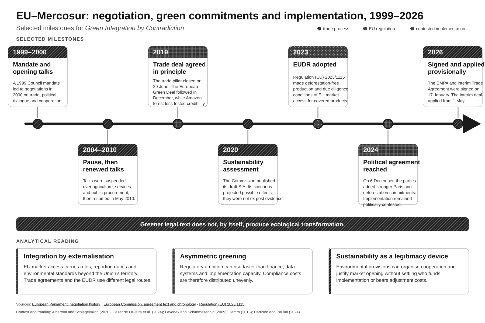

# Green Integration by Contradiction: EU Trade Policy and Latin America

## Abstract

This chapter examines how the European Union uses trade policy to extend sustainability rules beyond its territory. It compares the EU-Colombia/Ecuador/Peru Trade Agreement with the EU-Mercosur agreements through a qualitative analysis of treaty provisions, implementation records, evaluation documents and sectoral political economy. The two cases share the EU's broad Trade and Sustainable Development model but differ markedly in political trajectory. The Andean agreement has been absorbed into committee work, reporting and ex post evaluation. EU-Mercosur became a dispute over agriculture, deforestation and the credibility of the European Green Deal, even after the December 2024 political agreement and the provisional application of the interim Trade Agreement from 1 May 2026.

The chapter argues that greener treaty language does not necessarily produce greater ecological transformation. Sustainability provisions may organise cooperation and public scrutiny, yet they can also legitimise market opening while leaving enforcement, finance and adjustment costs unresolved. The EU Deforestation Regulation provides a harder form of market-based externalisation, but its amended timetable and demanding information requirements expose similar problems of capacity and distribution. The comparison identifies a fragmented regime in which negotiated agreements, autonomous regulation and evaluation procedures work on different timelines and allocate responsibility unevenly. Green integration is therefore contradictory: the EU can project regulatory demands more readily than it can create the material conditions for fair compliance. The resulting conflict concerns authority as much as environmental ambition, and turns on who pays for decarbonisation in global value chains.

## Keywords

European integration; trade policy; EU-Mercosur; EU-Andean agreement; sustainability governance; deforestation; Green Deal; externalisation; EU Deforestation Regulation; environmental justice; global value chains

## Introduction

European integration is often narrated as an internal project. The canonical story concerns the gradual pooling of sovereignty, the creation of common institutions and the consolidation of a market in which rules circulate across borders. That story remains indispensable, but it is no longer sufficient for understanding how the European Union presents itself and governs in a world of interdependent production. The Union increasingly integrates external relations into its internal regulatory project. Market access, due diligence, labour standards, climate commitments and environmental reporting now form part of the practical infrastructure through which European rules reach firms, governments and producers beyond the Union. Trade agreements are among the most visible sites of this outward movement.

This chapter examines that movement through two agreements with Latin American partners. The first is the EU-Colombia/Ecuador/Peru Trade Agreement, referred to here as the EU-Andean agreement. It is a useful case of relatively routine institutionalisation: the agreement has been applied with Colombia and Peru since 2013 and with Ecuador since 2017, and its implementation has been folded into reporting, committee work and an ex post evaluation process (European Commission 2023). The second is the EU-Mercosur agreement, whose trade negotiations concluded in 2019, whose political agreement was announced on 6 December 2024, and whose interim trade instrument began provisional application on 1 May 2026 (European Commission 2026a). These cases sit within a wider EU-Latin American trade relationship that has been documented as a significant and differentiated policy space rather than a single regional market (Grieger 2023). Unlike the Andean agreement, Mercosur became an object of intense political contestation over agriculture, deforestation, sovereignty and the credibility of European climate leadership.

The comparison is controlled rather than comprehensive. Both cases belong to the EU's new generation of comprehensive trade arrangements. Both contain dedicated Trade and Sustainable Development chapters. Both connect market opening with language on environmental protection, labour rights and international commitments. Both therefore provide an opportunity to examine what happens when the same broad legal template encounters different political economies and different levels of public contestation. The contrast is not between a sustainable agreement and an unsustainable one. It is between two different ways in which a common sustainability repertoire is translated into institutional practice.

The central argument is deliberately counterintuitive. The greening of treaty language does not automatically increase the capacity of an agreement to transform extractive export models. A greener text can coexist with weak enforcement, fragmented implementation and continued pressure to secure market access. In some circumstances, sustainability language operates primarily as a legitimacy device: it helps an agreement appear compatible with European values and contemporary climate politics while leaving the distribution of adjustment costs unresolved. In other circumstances, it provides a platform for cooperation, monitoring and political learning. The difference cannot be read from the presence of a sustainability chapter alone.

The argument has three parts. EU trade policy first works as integration by externalisation: selected European rules and categories enter production systems that remain outside the Union's political institutions. Market Power Europe and the Brussels Effect help to explain why access to a large, highly regulated market can alter conduct elsewhere, although neither mechanism guarantees equivalent implementation across firms or states (Damro 2015; Bradford 2020). Externalisation is also asymmetric. The EU can make access conditional on regulatory practices without supplying all the finance, data or administrative capacity needed to comply. Finally, the regime is fragmented. The Andean agreement, the Mercosur agreements, the Green Deal and the EUDR overlap, but they follow different timelines and enforcement logics.

The analysis proceeds in five stages. The conceptual section develops the notion of integration by externalisation and connects it to the literature on normative power and external governance. The first case then examines the Andean agreement as a relatively depoliticised site of implementation, with particular attention to evaluation and committee practices. The second case reconstructs the Mercosur trajectory and analyses the relationship between its sustainability chapter, agricultural political economy and deforestation politics. The cross-case section brings the two agreements together and uses the EUDR as parallel evidence of the opportunities and limits of European sustainability governance. The conclusion returns to the question of who bears the costs of decarbonisation when the EU seeks to green trade without fully resolving the conflicts built into global value chains.

## Conceptual framework: integration by externalisation

### From internal market integration to external regulatory reach

Integration by externalisation begins from a simple observation: the EU's internal market cannot be separated from the conditions under which goods, services and capital are produced outside the Union. If European consumers, companies and public authorities are governed by environmental and social rules, those rules increasingly affect suppliers in third countries. The resulting relationship is not the same as accession, association or traditional diplomacy. It is a form of regulatory reach in which access to the European market becomes a channel through which standards, procedures and categories travel.

The concept builds on the literature on external governance. Lavenex and Schimmelfennig (2009) describe external governance as the extension of EU rules and practices beyond the territorial boundaries of the Union through different forms of institutional connection. The mechanism may involve legal obligation, market incentives, administrative cooperation, emulation or socialisation. Trade policy is especially significant because it links rule transmission to a material relationship. A partner does not merely receive a norm. It encounters a set of conditions attached to access, recognition, certification or the continuation of commercial opportunities.

This perspective broadens the meaning of integration. Member States share institutions and coordinate domestic policy, while EU categories also organise conduct outside the Union. Due diligence, traceability, non-regression and international environmental commitments shape how external transactions are justified, measured and administered. Integration therefore has a spatially extended dimension.

Externalisation also has a temporal dimension. EU rules rarely arrive in a partner country as a single event. They are introduced through negotiations, implementation committees, reporting cycles, domestic legislation, private certification, administrative guidance and the repeated interpretation of ambiguous obligations. The legal text is a starting point rather than a complete outcome. Garcia and Gomez Arana (2025) show why implementation committees matter in this respect: they are sites where broad sustainability commitments are converted into agendas, priorities and requests for action. Their work also shows that those conversations take place under significant economic power asymmetries.

### Normative power and its limits

The externalisation framework is related to, but distinct from, normative power Europe. Manners (2002) drew attention to influence exercised through the diffusion of norms alongside material capabilities. Human rights, democracy, the rule of law and sustainable development form part of that repertoire. Trade agreements connect these norms to commercial incentives.

The difficulty is that the language of norms does not settle the politics of their application. A norm can be universal in aspiration and asymmetric in operation. When the EU defines a due-diligence requirement for a product entering its market, the requirement may be justified by a global environmental objective while imposing costs on producers whose access to data, finance, mapping technology and public administration is uneven. The externalisation of a norm is therefore also a distributional event. It changes who must document, monitor, certify and absorb risk.

The normative power perspective is most useful when combined with a political economy of implementation. It identifies the values that the EU claims to project, but cannot show by itself whether rules are enforceable, adequately funded or ecologically effective. Claar's (2022) critique of green colonialism is relevant here as a warning rather than a verdict. Environmental measures can reproduce dependency when European priorities define the transition while producers and governments elsewhere carry a disproportionate share of its costs. The issue is therefore what sustainability language does within an arrangement shaped by market access, geopolitical competition and unequal administrative capacity.

### Why sustainability chapters do not all bind in the same way

The EU's Trade and Sustainable Development chapters are central to this problem. Marín Durán (2020, 1031-68) shows that they emerged as a distinctive EU approach to integrating labour and environmental issues into new-generation free trade agreements. The model contains substantive commitments, institutional bodies and procedures for dialogue and dispute examination. It is also a promotional model: it favours cooperation, monitoring and recommendations over the direct use of trade sanctions for non-compliance.

This design has several consequences. It can preserve space for dialogue and reduce the risk that every disagreement becomes a zero-sum trade conflict. It can also make it difficult to establish consequences when a party fails to implement a commitment. The chapter may require parties to maintain levels of protection, effectively enforce domestic laws or implement international agreements, but the route from a breach to a material change in production is not automatic. The legal status of a commitment, the clarity of the obligation, the institutional capacity to monitor it and the political will to pursue it all matter.

Akdogan (2025) sharpens this point by asking what TSD chapters require in relation to multilateral labour and environmental standards. A reference to the Paris Agreement, the International Labour Organization or an environmental convention matters only insofar as it creates an obligation that can be interpreted, implemented and assessed. Textual density can give a misleading impression of force. Harrison and Paulini (2024) make the broader distributive point in the Mercosur context: the EU model treats sustainability impact assessments and TSD chapters as the main bridge between trade, environment and development, yet leaves socio-economic equality and the allocation of environmental responsibility at the margins. Stronger wording is therefore only one part of institutional reform.

The EU's later move towards more assertive enforcement reflects dissatisfaction with the earlier promotional model, including debate over sanctions and the relationship between TSD disputes and general trade remedies (Remondino 2023). The change does not make every obligation equally enforceable. The wording of the commitment, available evidence and the institutional route from complaint to remedy still determine what enforcement can achieve.

Legal inclusion and practical effect must be separated in both cases. The agreements contain a related sustainability repertoire, but it performs different institutional work. In the Andean case, it supports committees, reporting and incremental learning. In Mercosur, similar language became an object of bargaining, external pressure and reputational conflict. The analysis must therefore connect treaty wording with disputes, evaluations and implementation practice.

### Legitimacy devices and geopolitical bargaining

The notion of a legitimacy device does not imply that sustainability clauses are empty. A device can have effects even when it does not deliver the transformation its language suggests. Sustainability language can reassure European publics that market opening is consistent with the Green Deal. It can provide a common vocabulary for officials and firms. It can make an agreement more defensible in parliamentary and civil-society debate. It can also narrow the terms of contestation by translating political conflict into questions of compliance, reporting and technical assistance.

At the same time, the legitimacy function can obscure unresolved conflicts. In the Mercosur case, the EU seeks both deeper access to agricultural and industrial markets and a stronger environmental profile. The partner governments seek access, policy space and recognition that their development trajectories cannot be judged only through European categories. A sustainability chapter can contain these disagreements without resolving them. It creates an arena in which the parties can signal commitment while the material distribution of gains and adjustment costs remains unsettled.

Geopolitical bargaining belongs inside the analysis. Agreements become more valuable when the EU seeks a stronger presence in Latin America, more diverse supply chains or evidence that open trade remains possible under pressure. Strategic value can also make governments reluctant to jeopardise closure by demanding more coercive environmental instruments. Albertoni and Schlegelmilch (2026) describe a Mercosur process in which the cost of failure changed even though the underlying conflicts remained. The final text should therefore be read as a negotiated compromise, not a settled consensus.

### Method and limits of the comparison

The chapter uses a qualitative controlled comparison of agreement texts, official evaluation and implementation materials, academic analysis and the parallel development of the EUDR. The comparison is organised around four questions: what sustainability obligations exist; how are they monitored and enforced; what sectoral pressures shape implementation; and what forms of legitimacy or contestation do the instruments produce? The evidence set is documented in the accompanying source register and claim-evidence audit.

The method has two limits. First, the Mercosur instrument has only recently entered provisional application, so a full ex post assessment of ecological outcomes is not yet possible. The chapter therefore distinguishes observed institutional developments from projected effects and normative arguments. Second, the evidence is uneven across cases. The Andean agreement has a longer implementation history and a published evaluation architecture. Mercosur has a more visible negotiation and controversy record but less evidence of long-run implementation. The comparison should therefore be read as an analysis of governance trajectories, not as a statistical test of environmental effectiveness.

## Case one: the EU-Andean agreement and the quiet politics of implementation

### A common template with a different political trajectory

The EU-Andean agreement is not a minor or purely commercial instrument. It covers tariffs, non-tariff barriers, services, investment and a range of regulatory issues, while connecting trade to sustainable development. The agreement's implementation history is nevertheless less politically explosive than the Mercosur case. It has been applied with Colombia and Peru since 2013 and with Ecuador since 2017, and the Commission maintains annual reports, evaluation documents and implementation materials for the relationship (European Commission 2023).

The case is analytically valuable precisely because it appears ordinary. The absence of continuous high-profile contestation does not mean that sustainability commitments are automatically effective. It means that the commitments are processed through an institutional environment in which routine administration can dominate public conflict. The question is therefore how a sustainability chapter behaves when it is not constantly exposed to a major crisis of legitimacy.

The agreement illustrates the first mechanism of integration by externalisation: a common framework organises relations across several national settings while allowing the partner countries to retain formal sovereignty. The EU does not administer Colombian, Ecuadorian or Peruvian environmental policy. Instead, it establishes a structure in which domestic measures, international commitments and trade effects can be discussed in relation to a shared agreement. The institutional result is neither internal EU integration nor simple bilateral diplomacy. It is a layered form of association.

### Evaluation as a mode of depoliticisation

The Commission's evaluation architecture is central to this mode of governance. The Commission distinguishes impact assessments before negotiations, Sustainability Impact Assessments during negotiations, economic analysis after the negotiated outcome and ex post evaluations after implementation has generated evidence (European Commission 2023). The Andean agreement has entered the last of these stages. The existence of a formal ex post evaluation does not prove that sustainability objectives have been achieved. It does, however, create an institutional vocabulary for asking whether the intervention worked, whether effects were unintended and whether causal mechanisms can be identified.

Evaluation can depoliticise in two senses. First, it translates disagreement into a technical process involving indicators, baselines and stakeholder consultations. Second, it separates the production of evidence from the moment of political negotiation. The result can be constructive: evidence becomes available for future adjustment. But it can also reduce the visibility of distributional conflict. A question about who bears the cost of traceability may appear as a question about implementation capacity, while a disagreement over the right to regulate may appear as a question about the interpretation of a clause.

Sustainability governance involves choices about what deserves measurement. An evaluation may record trade flows, committee meetings and domestic legislation while placing land concentration, informal labour, community rights or unequal exposure to market volatility at the margins. The quiet institutionalisation of the Andean agreement is therefore a form of political ordering rather than an absence of politics.

The documentary record supports this cautious reading. The Commission's final ex post study assessed effectiveness, impact, efficiency, coherence and relevance across economic, social, environmental and human-rights dimensions (European Commission 2022). Its existence is important because the agreement has generated a longer evidentiary trail than Mercosur. It should not, however, be treated as a single measure of sustainability performance. The study combines different causal claims, indicators and case studies, and the Commission's later staff assessment remains part of an institutional evaluation process rather than an independent counterfactual test of the agreement's environmental effects.

Parliamentary scrutiny also shows what routine evaluation can miss. In 2019, the European Parliament welcomed aspects of implementation but called for stronger labour inspection, more independent civil-society participation, effective implementation of International Labour Organization conventions and protection against legislative changes that could lower environmental standards to attract investment (European Parliament 2019). It also drew attention to informality and the position of women workers. These concerns were not marginal additions to trade policy. They identified the social institutions through which nominal commitments either acquire practical force or remain procedural.

The earlier European Implementation Assessment reached the same policy field through a broader review of trade, investment and the TSD chapter (Zygierewicz 2018). Taken together, the reports show a case with substantial documentary oversight but no single indicator capable of settling whether trade liberalisation improved environmental or labour outcomes.

### Implementation committees and asymmetrical dialogue

The most useful evidence for the practical operation of this order comes from the study of implementation committees. Garcia and Gomez Arana (2025) examine publicly available implementation documents and interviews concerning the EU-Andean and EU-Central America agreements. They find that the agreements are living arrangements: their texts provide a starting point for implementation, while committees determine which issues become visible and which forms of action are requested. Sustainability discussions take place, but they do so within relationships marked by economic asymmetry.

The committees therefore matter both for adaptation and for agenda control. Garcia and Gomez Arana (2025) show that implementation can respond to newer sustainability concerns, but engagement is uneven and shaped by the resources and priorities that each side brings to the table. Domestic Advisory Groups and joint civil-society meetings can widen access to the process. Their presence does not ensure that producer organisations, informal workers or affected communities can influence decisions on equal terms. Participation must be assessed through representation, access to information and evidence of follow-up, not by counting meetings alone.

The committee is therefore a hybrid institution. It is more structured than informal diplomacy, but less coercive than a court. It creates regularity without eliminating discretion. European officials can raise concerns, request information or propose cooperation. Partner governments can contest priorities, explain institutional constraints or demand recognition of domestic circumstances. Civil-society participation may widen the range of issues, but it does not by itself change the distribution of bargaining power.

This structure can produce incremental learning. Repeated discussions can clarify terms, connect agencies and encourage parties to compare policies. A committee can also provide a channel through which environmental and labour actors remain connected to trade governance rather than being excluded from it. Yet incrementalism has a built-in weakness. If implementation is always framed as gradual improvement, the parties may avoid identifying situations in which the trade relationship itself contributes to the underlying problem.

The Andean case therefore reveals a modest but important form of European integration. The Union extends a procedural order: evaluation, committee dialogue, implementation reports and shared references to sustainability. The order is real and can influence domestic administration. It is not equivalent to ecological transformation. The gap between the two is where the chapter's broader argument begins.

### Why the case remained relatively depoliticised

Several features help explain the case's relatively depoliticised trajectory. The agreement was implemented in stages rather than presented as a single dramatic geopolitical bargain. Its evaluation architecture developed through ordinary Commission procedures. The public controversy surrounding it has not reached the symbolic intensity associated with the Amazon, the Green Deal and the European agricultural debate. And the agreement's sustainability issues are spread across several countries and sectors, making it more difficult to concentrate attention on one emblematic conflict.

These conditions do not make the agreement less important. They make visible a different way in which sustainability is governed: through routine institutionalisation. A less visible agreement can still generate obligations for producers and public authorities. It can also establish expectations about how future agreements should be monitored. The absence of a crisis may indicate that externalisation is working smoothly, but it may equally indicate that political conflict has been displaced into technical arenas.

The agreement's contribution depends on the definition of integration. It has increased the density and regularity of cross-border relations. Evidence that it has reduced ecological asymmetries or changed the development model associated with trade is more limited. The Commission's evaluation architecture can address that question only if its indicators and consultations capture those asymmetries rather than treating them as background conditions.

### What the Andean case reveals analytically

The Andean case shows that the shared EU template is not a self-executing instrument. Its practical effects depend on the institutional spaces created after signature. The agreement provides a frame for interaction, but the frame does not determine which actor will use it, which demands will be prioritised or how implementation costs will be distributed. Externalisation is therefore a process of negotiated translation.

The case also shows why a comparison with Mercosur should not be reduced to a contrast between cooperation and conflict. The Andean agreement's quieter trajectory may make cooperation easier to observe, but it can also hide the political choices embedded in routine evaluation. What is made technical is not necessarily less political. It is often political in a different register.

Finally, the case demonstrates that the EU's normative reach is strongest where it can be embedded in procedures. The EU may not secure direct control over partner-country policy, but it can establish a durable vocabulary for reporting, evaluation and committee work. That vocabulary is a form of integration. Its limits appear when the underlying issue is not only a lack of coordination but a conflict over development, market access and the distribution of environmental costs.

## Case two: the EU-Mercosur agreement and the crisis of green credibility

### From long negotiation to provisional application

The EU-Mercosur agreement offers a more difficult test of externalisation. The Council adopted negotiating directives in 1999, and formal talks opened in 2000. Negotiations on the trade component concluded in 2019, while the political agreement on an improved Partnership Agreement was reached on 6 December 2024 (Albertoni and Schlegelmilch 2026; European Commission 2026a). These dates refer to different legal and political stages rather than to a single moment of agreement.

The 2024 conclusion occurred in a changed geopolitical environment. The EU sought to maintain a strategic relationship with Latin America, strengthen supply-chain options and demonstrate that it could still conclude ambitious trade agreements. Mercosur governments sought access to the European market while defending domestic policy space and the political legitimacy of agricultural and industrial strategies. The agreement's value was therefore not limited to tariff preferences. It also represented strategic positioning and reassurance in an unsettled trading system.

Figure 1 separates the negotiating milestones from two developments that shaped the agreement's environmental context: the European Green Deal and the EUDR. The instruments are legally distinct, but producers, exporters and public authorities encounter them as an overlapping set of expectations about trade, land use and market access. Reading them together makes the sequence easier to follow without treating chronology as evidence of environmental effectiveness.

*Source: Authors' compilation from the European Parliament's negotiation history, European Commission agreement texts and chronology, Regulation (EU) 2023/1115, Albertoni and Schlegelmilch (2026), and Cesar de Oliveira et al. (2024).*

The interim Trade Agreement was signed with the Partnership Agreement on 17 January 2026 and began provisional application on 1 May after the required procedures were completed (European Commission 2026a). This recent change narrows what can be claimed. The legal sequence can be documented, but its environmental effects cannot yet be assessed ex post. The discussion that follows therefore concentrates on the obligations, procedures and implementation questions created by the revised sustainability architecture.

### What changed in the sustainability architecture

The European Commission presents the 2024 outcome as including new commitments on sustainability, the Paris Agreement and deforestation. The trade and sustainable development factsheet states that the Paris Agreement becomes an essential element of the agreement and that the parties commit to addressing deforestation. It also describes a procedure in which formal government consultations may be followed by an independent panel of experts whose report is made public (European Commission 2026c).

These changes matter. Treating the Paris Agreement as an essential element gives climate commitments a status that differs from a purely aspirational reference. The deforestation language responds to a central concern about agricultural expansion and land-use change. The expert-panel procedure creates a route for public scrutiny and institutional follow-up. The 2024 text is therefore not simply a repetition of the 2019 outcome.

But the changes do not eliminate the structural limits of TSD governance. A panel of experts can examine and recommend; it does not necessarily impose a trade sanction or directly change the production practices at issue. The status of a Paris commitment can increase political leverage, but it does not resolve disputes over measurement, responsibility or financing. A deforestation commitment can signal a shared objective while leaving the difficult question of who must collect data, verify origin and pay for compliance unresolved.

The legal architecture should therefore be read in two registers. In the first, it strengthens the agreement's normative profile. In the second, it reveals the distance between stronger language and a complete enforcement chain. The gap is not evidence that the new provisions are meaningless. It is evidence that the relationship between text and transformation remains mediated by institutions, capacities and political economy.

### The agricultural and land-use contradiction

The environmental conflict surrounding Mercosur cannot be separated from the structure of trade. The EU imports agricultural commodities from the region, while Mercosur countries seek to preserve or expand productive opportunities in sectors that are politically and economically significant. Land-use change is therefore not an external side effect that can be corrected by adding a paragraph to the agreement. It is embedded in the relationship that the agreement is designed to deepen.

Cesar de Oliveira and colleagues (2024) show that EU agri-food imports are connected to land conversion in Brazil and that the agreement's potential effect on land-use change must be assessed within a wider governance system. Their analysis does not reduce the agreement to an instrument of deforestation. It identifies the possibility that the agreement could become an additional tool for cooperation while also emphasising limitations common to other FTAs. The analytical implication is important: an agreement can contribute to a governance framework without being capable of controlling the whole causal chain.

Fuchs and colleagues (2024) identify a related problem in the interaction between the agreement and the EUDR. Their analysis points to loopholes and displacement risks: stricter controls on products destined for the EU may redirect land-intensive production or trade towards other markets, while commodity coverage and traceability rules may leave parts of the land-use system outside scrutiny. This is a critique of regulatory design, not evidence that the EUDR necessarily increases deforestation. It does show why treaty commitments, autonomous regulation and domestic land policy must be analysed together.

The material limit of externalisation is clear. The EU can regulate entry to its market, but trade law alone cannot determine land-use priorities in Brazil, Paraguay, Uruguay or Argentina. Incentives, information requirements and cooperative procedures operate alongside domestic institutions, producer strategies, commodity prices and alternative export markets. Externalisation alters the field of choice without determining the outcome.

The issue is also distributive. Compliance requires data about plots of land, production histories, supply-chain relations and legal status. Large exporters may be able to organise these systems more easily than smallholders and smaller intermediaries. If the cost of verification is transferred down the chain, the market may become more traceable while becoming less inclusive. A sustainability instrument can therefore improve the formal quality of evidence and still deepen inequalities among producers.

### The Sustainability Impact Assessment and the politics of projection

The Commission's 2020 publication on the Mercosur Sustainability Impact Assessment is useful because it makes the status of the evidence explicit. The report was an independent assessment of possible economic, social, environmental and human-rights impacts. It used hypothetical scenarios, and the Commission noted that neither scenario was identical to the negotiated outcome. The assessment projected gains in some economic sectors and stated that the environmental modelling predicted no impact on global greenhouse-gas emissions under its assumptions (European Commission 2020).

The statement is not an observed outcome. It is a model-based projection constructed before the final institutional and political history of the agreement had unfolded. Its value lies partly in showing how the agreement was made legible to decision-makers: through scenarios, sectoral effects and assumptions about policy implementation. Its limitation is equally important. Models can represent the effects of tariff changes and emissions intensity more easily than they can represent contested enforcement, uneven monitoring capacity or political resistance to land-use rules.

The SIA nevertheless recognises a point that supports the chapter's argument. It states that deforestation outcomes depend on the adoption and effective enforcement of appropriate environmental policy measures. The trade agreement alone is not sufficient. This places the burden on the relationship between trade preferences, domestic environmental institutions and international cooperation. The green character of the agreement depends on a policy ecosystem that extends well beyond the treaty text.

Harrison and Paulini (2024) press the criticism further. They argue that the EU's sustainability framework separates environmental and developmental questions from the commercial core of the agreement. On this reading, an SIA may catalogue risks and a TSD chapter may establish dialogue, while tariff schedules and market-opening commitments remain largely insulated from those findings. Their proposed emphasis on planetary boundaries and socio-economic equality is more demanding than the current EU model, but it clarifies the benchmark: sustainability should affect the design and distribution of trade commitments, not merely accompany them.

### The Green Deal as external promise and internal constraint

The European Green Deal provides the larger political context for the Mercosur controversy. The 2019 Commission communication presents a growth strategy intended to transform the EU into a resource-efficient and competitive economy, reach climate neutrality by 2050 and make environmental challenges an opportunity across policy areas (European Commission 2019). When the EU negotiates trade under this framework, it is expected to align external market opening with internal decarbonisation.

That expectation creates a double pressure. The Green Deal gives the EU a stronger normative basis for demanding sustainability commitments from partners. It also gives domestic actors a stronger basis for challenging agreements that appear to undermine environmental objectives. The same language that increases the EU's external leverage can therefore increase internal contestation. Externalisation becomes politically unstable when the Union's external commitments are judged against the credibility of its internal transformation.

The Mercosur agreement became a symbol of this contradiction because agriculture, forests and climate politics entered the same negotiation. Supporters presented it as a platform for cooperation and market opening. Critics argued that improved access for agricultural commodities could intensify the pressures addressed by the Green Deal. The dispute concerned whether one instrument could pursue market integration and ecological transformation at the same time.

Recent secondary analyses reinforce this tension. Lima, Pires and Resende (2026) find that the agreement's sustainability clauses promote green practices but that their effectiveness is constrained by insufficient enforcement and local implementation challenges. The article is a secondary interpretation, not a legal authority, but it helps identify the recurring mechanism: the EU can make the text greener without resolving the institutional conditions through which the text would become a change in behaviour.

### Strategic closure and unresolved conflict

The political conclusion of December 2024 should therefore be understood as a moment of strategic closure rather than a disappearance of conflict. Albertoni and Schlegelmilch (2026) argue that the agreement moved forward when the cost of failing to reach it changed. That account helps explain why a long-standing negotiation could become politically possible without all disagreements being resolved. Geopolitical value can make closure attractive even when environmental and agricultural conflicts remain.

This does not mean that the EU traded away sustainability. It means that sustainability became one objective within a larger bargaining structure. The final outcome had to be defensible to European constituencies, acceptable to Mercosur governments and compatible with a changing external environment. The result was a layered compromise: stronger climate and deforestation language, continued market-opening objectives, new explanatory and institutional materials, and a future implementation process in which the hardest distributive questions remain.

The distinction between commitment and settlement is central. A commitment records what the parties say they will do. A settlement would also specify how disagreements will be resolved, who finances compliance, how evidence is shared, how affected communities participate and what happens when obligations are not met. The Mercosur agreement has moved further toward commitment, but the settlement of the political economy of decarbonisation remains incomplete.

### Why Mercosur is the heavier case

Mercosur is empirically heavier than the Andean case for three reasons. First, the negotiation itself became part of the dispute. The twenty-five-year trajectory, the 2019 conclusion, the 2024 political agreement and the 2026 provisional application are all politically meaningful. Second, the agreement is tied to an emblematic environmental issue: deforestation and land-use change in Amazonian and Cerrado territories. Third, the case brings the EU's external commitments into direct contact with its internal climate and agricultural politics.

The case therefore exposes the limits of a procedural understanding of integration. Committees, evaluations and expert panels are necessary, but they operate within a conflict over the direction of development. The EU may be able to externalise a rule more readily than it can externalise the social and financial conditions required for compliance. In a politically quiet setting, this distinction may remain hidden. In Mercosur, it is the centre of the controversy.

## Cross-case analysis: asymmetric greening and parallel regulation

### Same template, different political work

The comparison shows that a common EU template can perform different political work. In the Andean case, the sustainability chapter is embedded in routine implementation, committee dialogue and ex post evaluation. In the Mercosur case, sustainability language is part of a high-stakes bargaining process involving market access, geopolitical positioning and land-use conflict. The institutional form is related, but the political meaning is not.

This difference cautions against treating the presence of a TSD chapter as a proxy for integration. The chapter may increase the density of relations and the visibility of sustainability. It may create procedures that did not previously exist. But its capacity to transform production depends on whether the procedures connect to domestic enforcement, credible information and resources. Integration is therefore differentiated by the conditions under which externalisation is received.

### Greener text and weaker transformation

The phrase "asymmetric greening" captures the central comparative finding. The EU's agreements can become greener at the level of language, architecture and public justification while their capacity to reshape extractive models remains uncertain. The asymmetry is between the EU's ability to define market conditions and the partners' unequal ability to meet them. It is also between the Union's capacity to demand compliance and its limited willingness to supply the finance and policy space that would make compliance socially sustainable.

The Andean agreement demonstrates the procedural side of this process. It has an established evaluation architecture and implementation committees, but the existence of those institutions does not show that the underlying structure of production has changed. Mercosur demonstrates the political side. Stronger environmental language can be added because it helps secure legitimacy and respond to contestation, but the language does not by itself settle the agricultural and land-use conflict.

### The EUDR as independent confirmation

The EU Deforestation Regulation is a useful parallel instrument because it is not a clause of either agreement. Regulation (EU) 2023/1115 establishes rules for commodities and products associated with deforestation and forest degradation. The regime requires operators and traders to provide evidence that covered products are not associated with recent deforestation or forest degradation and connects market access to due diligence (European Parliament and Council 2023). The Commission describes the regulation as part of an effort to reduce greenhouse-gas emissions, biodiversity loss and the EU's global footprint (European Commission 2026b).

The EUDR demonstrates a harder form of externalisation than the promotional TSD model. It works through autonomous EU law and conditions for placing products on the Union market. Its reach does not depend on the completion of a bilateral agreement. It can therefore be read as a test of whether market power can produce faster environmental leverage than a negotiated sustainability chapter.

The implementation timetable also reveals the difficulty of converting legal ambition into an operational system. Following amendments in December 2024 and December 2025, the Regulation is due to apply from 30 December 2026 to large and medium operators and to micro and small operators already covered by the EU Timber Regulation. Other micro and small operators are covered from 30 June 2027 (European Commission 2026b). On 13 July 2026, the Commission adopted further measures on product scope and the information system, including simplified declarations for some small primary operators (European Commission 2026d). These changes do not prove failure. They show that data infrastructure, product coverage and administrative burden are part of the politics of implementation.

The EUDR also illustrates a potential contradiction between autonomy and cooperation. An autonomous measure can create a clear market signal, but it may be experienced by partners as unilateral regulation with extraterritorial effects. The EU seeks to reduce this problem through guidance, information systems, country benchmarking and cooperation initiatives. Still, the distribution of evidentiary burdens remains uneven. The regulation may increase traceability and at the same time intensify the pressure on actors with the least capacity to document production.

### From regulatory power to regulatory asymmetry

External governance is often analysed as a form of power because the EU's market is attractive. The comparison suggests that power must be specified more carefully. The EU has regulatory power when it can define a condition that firms and partner governments must consider. It has implementation power only when the condition can be monitored, financed and enforced through a credible chain of institutions. It has transformative power only when the combination of rules and resources changes the production model rather than simply reallocating compliance costs.

The EU-Andean and EU-Mercosur cases show a recurring slippage between these forms. Regulatory power can be mistaken for transformative power. A rule can be formally binding and operationally weak. A standard can be demanding and socially regressive. A treaty can be green in its preamble and unable to overcome the incentives embedded in commodity trade. The concept of asymmetry identifies this slippage without denying that rules can have real effects.

### Legitimacy devices are not empty devices

The legitimacy-device thesis should not be interpreted as a claim that the EU deliberately writes sustainability language with no intention of implementation. The more defensible claim is functional. Sustainability provisions can legitimise an agreement even when their implementation remains uncertain. They can organise expectations, create a common public vocabulary and make compromise possible. Their legitimacy effects are real, but they may exceed their demonstrated environmental effects.

The risk is that legitimacy becomes a substitute for settlement. If the parties can repeatedly signal shared commitment without clarifying responsibilities, the governance system may stabilise a conflict rather than resolve it. The result is a fragmented and hierarchical regime: fragmented because several instruments overlap without a single enforcement hierarchy; hierarchical because the EU retains greater power to define conditions while partners and producers bear more of the immediate adjustment burden.

### Who bears the costs of decarbonisation?

The normative stakes are clearest when the analysis is turned toward distribution. Decarbonisation in global value chains requires changes in production, monitoring, transport, finance, technology and land use. If the EU places the burden primarily on exporters and producers, it may reduce the environmental risk associated with consumption while transferring adjustment costs to territories with fewer resources. If it provides finance and cooperation without credible accountability, it may subsidise compliance without changing the underlying model. Neither problem is solved by the word "sustainable".

The Andean case suggests that evaluation and committee dialogue can make distributional questions visible, but only if they are included in the evidence and the participation structure. The Mercosur case shows that distributional questions can block or reshape political agreement when they become associated with sovereignty and development. The EUDR adds a third lesson: an autonomous instrument may be legally clearer than a negotiated chapter while still generating political resistance if its operational demands are not perceived as fair.

Environmental justice therefore belongs in the analysis without turning the chapter into an advocacy document. The issue is not to decide in advance which policy outcome is just. It is to recognise that regulatory externalisation redistributes decision-making power and compliance costs. An integration project that ignores this redistribution may deepen the North-South asymmetries it claims to manage.

### What would make externalisation more transformative?

Externalisation becomes more credible when obligations lead to measurable duties, monitoring rests on shared data and affected actors can influence implementation. Cooperation and finance must form part of the environmental instrument, particularly where new requirements depend on public registries, geolocation or traceability systems that are unevenly available. Enforcement must also carry consequences, although sanctions alone cannot reorganise production or correct unequal bargaining power.

These conditions imply responsibilities for the EU as well as leverage over partners. A transformative approach would help build the administrative and financial capacity that European rules presuppose, while allowing contextual adaptation and contestation. It would also offer a practical test of the legitimacy-device thesis: sustainability provisions that connect rules, resources, participation and remedy do more than make market opening defensible.

### A fragmented integration regime

Fragmentation follows from the allocation of authority among instruments. Negotiated agreements depend on consent and reciprocity; autonomous regulations arise from the EU's legislative process; evaluations generate knowledge without changing the legal text; and cooperation projects may build capacity without binding accountability. Each instrument has a distinct institutional logic, but their interaction is weakly coordinated.

The sequence matters. A treaty may be negotiated before a regulatory system is operational, and a due-diligence rule may take effect before partner-country data systems are compatible with it. Committees may discuss formally important issues without access to the budgetary decisions needed to act. Ambition, preparation and enforcement therefore move at different speeds.

The evidence is equally fragmented. An SIA projects economy-wide effects, committees receive qualitative reports, and the EUDR demands information tied to particular production sites. These sources answer different questions. Projections cannot establish observed outcomes, administrative records do not capture every local effect, and testimony cannot by itself identify economy-wide causation. Credible evaluation must connect them without pretending that they are interchangeable.

The same point applies to causality. If a producer adopts a traceability system after an EU regulation, the change may be attributed to market pressure, domestic law, a private standard, a buyer's procurement policy or several factors at once. If deforestation declines, the outcome may reflect enforcement, commodity prices, land-use policy, monitoring technology or changes in export destinations. The chapter therefore avoids claiming that either agreement has caused a specific ecological outcome. It identifies mechanisms and institutional conditions that make certain outcomes more or less plausible. That is a more modest conclusion, but it is also better suited to the current evidence.

Fragmentation also disperses accountability across the Commission, Member State authorities, partner governments, firms, certification bodies and committees. When implementation stalls, each actor can point elsewhere. A clearer architecture would specify how treaty platforms, market-access rules, evaluation and capacity-building fit together, and which institution must respond when evidence reveals a gap.

European integration need not be reduced to one instrument. It does require an account of how the instruments interact. Without that account, regulatory reach will continue to expand faster than the capacity to make it fair, effective and politically durable.

## Conclusion: integration without settlement

Can EU trade policy with Latin America be understood as an instrument of European integration? The answer is yes, but only if integration is understood as a differentiated process that extends European rules, procedures and political categories beyond the Union's territory. The EU-Andean agreement and the EU-Mercosur agreement show that trade can create durable cross-border institutional relations. It can organise evaluation, committee work, reporting, due diligence and public expectations. In that sense, it is not external to European integration. It is one of its contemporary forms.

The answer is more qualified if integration is expected to deliver ecological transformation. The common TSD template does not determine outcomes. In the Andean case, it has supported a relatively quiet process of institutionalisation and ex post evaluation. In the Mercosur case, it has been drawn into a conflict over agricultural access, deforestation, geopolitical strategy and Green Deal credibility. The same broad repertoire can therefore stabilise cooperation in one setting and expose contradiction in another.

The chapter's counterintuitive conclusion is that greener treaty language may coincide with weaker transformative capacity when environmental ambition is used to make market opening politically acceptable without resolving the material conflicts of decarbonisation. This is not an argument against sustainability provisions. It is an argument for evaluating what they do. They can create cooperation, information and political leverage. They can also function as legitimacy devices that defer questions of responsibility, financing and enforcement.

The EUDR strengthens this conclusion by showing that autonomous regulation is not a simple alternative to negotiated trade governance. It can provide a sharper market signal, but its implementation has also been amended and delayed. The evidence therefore points toward a fragmented regime rather than a single European model of green integration. Trade agreements, autonomous regulations, evaluation systems and cooperation initiatives overlap, sometimes reinforcing one another and sometimes producing new asymmetries.

This fragmentation also limits accountability. A treaty committee, an importing firm and a partner-country authority may each comply with its own procedure while no institution takes responsibility for the combined environmental and social outcome. Integration without institutional coordination can therefore increase regulatory density without settling the underlying conflict.

The political question that follows is who bears the costs of this arrangement. If the EU externalises standards without externalising capacity and resources, producers and partner governments will bear a disproportionate share of compliance costs. If it softens standards to preserve strategic access, ecological ambition may become a language of reassurance rather than transformation. A more credible approach would treat market access, environmental protection and distributive responsibility as connected elements of the same integration project.

The EU's Latin American agreements do not provide a finished model. They provide a field in which the future of European integration is being negotiated beyond Europe. Their significance lies not in proving that trade is either green or ungreen, but in showing how sustainability becomes a transnational struggle over authority, evidence and costs. The task for the next phase of European trade policy is to close the distance between the rules it projects and the capacities it helps create. Without that link, green integration will remain integration by contradiction.
